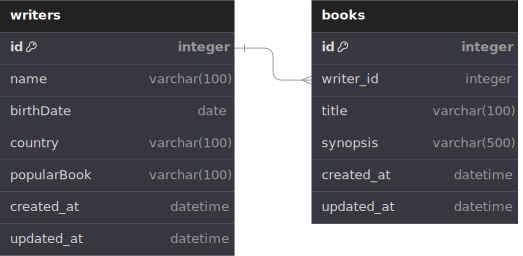

# Writer Backend REST API

## REST API Endpoints

| Endpoint       | HTTP     | Description         |
| -------------- | -------- | ------------------- |
| `/writers`     | `GET`    | Get all writers     |
| `/writers/:id` | `GET`    | Get writer by id    |
| `/writers`     | `POST`   | Add new writer      |
| `/writers/`    | `DELETE` | Delete all writers  |
| `/writers/:id` | `DELETE` | Delete writer by id |
| `/writers/:id` | `PUT`    | Update writer by id |

## Database Design/Schema/ERD



## Getting Started

To install dependencies:

```sh
bun install
```

To run:

```sh
bun run dev
```

open http://localhost:3000
